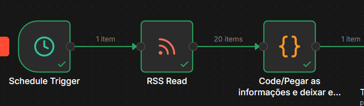
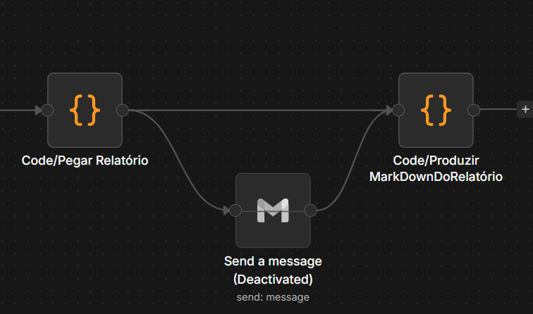

# 🤖 Sistema de Agregação de Notícias de IA — Inteli Academy

> Workflow automatizado no n8n que coleta, analisa e gera um relatório semanal de Inteligência Artificial usando um sistema de múltiplas IAs em sequência.

**Autor:** Arthur Loyola  
**Processo Seletivo:** Inteli Academy  
**Ferramenta principal:** n8n (self-hosted via Docker)

---

## 📌 Visão Geral

O projeto resolve um problema real: a fragmentação de informações sobre IA na internet. Em vez de garimpar manualmente dezenas de fontes toda semana, o workflow roda automaticamente toda segunda-feira às 8h e entrega um relatório completo em Markdown com notícias categorizadas, tendências reais e oportunidades para startups.

A grande sacada do projeto foi construir um **sistema editorial com múltiplas IAs**, onde cada agente tem uma função especializada  como uma redação de verdade.

---

## 🏗️ Arquitetura do Workflow

O workflow é dividido em 3 etapas principais:

A primeira, a do retângulo azul, está relacionada ao trigger, coleta de notícias e organização das noticias.

A segunda, a do retângulo verde, são o time de news de IAs

A terceira, a do retângulo rosa, é o processo de geração do relatório


## 🔍 Como Cada Nó Funciona

### 1. Schedule Trigger
Gatilho automático configurado para rodar toda **segunda-feira às 8h** (fuso horário: America/Sao_Paulo).

### 2. RSS Feed Read
Coleta as 20 notícias mais recentes do feed de IA do TechCrunch:
```
https://techcrunch.com/category/artificial-intelligence/feed/
```
Cada item retorna: `title`, `contentSnippet`, `link`, `pubDate` e `categories`.

### 3. Code Node — Formatação
Transforma os 20 itens separados em um único bloco de texto limpo para enviar ao Groq:
```javascript
const itens = $input.all();
const texto = itens.map((item, i) => {
  const d = item.json;
  return `${i + 1}. ${d.title} | ${d.contentSnippet} | Link: ${d.link}`;
}).join(' /// ').replace(/'/g, "");
return [{ json: { noticias: texto } }];
```
O `.replace(/'/g, "")` é crítico — remove aspas simples dos títulos que quebrariam o JSON.stringify posteriormente.




### 4. IA 1 — Triagem e Categorização
Recebe as 20 notícias brutas e categoriza cada uma em: IA Generativa, Aprendizado de Máquina, Visão Computacional, Ética em IA, Hardware e Infraestrutura, Regulamentação e Política, ou Aplicações em Setores. Não faz análises — apenas classifica.

### 5. IA 2 — Analista de Tendências
Recebe as notícias já categorizadas e identifica 4 tendências reais com evidências concretas — citando notícias específicas, não generalizações.

### 6. IA 3 — Analista de Oportunidades
Identifica 5 oportunidades concretas para startups baseadas nas notícias da semana, com justificativa e setor de aplicação.

### 7. IA 4 — Redator-Chefe
Recebe os três insumos anteriores e monta o relatório final com linguagem editorial profissional. É instruído a usar o material dos analistas integralmente, sem resumir ou generalizar.


> 💡 **Por que múltiplas IAs?** 

Uma única IA tentando categorizar 20 notícias, identificar tendências, mapear oportunidades e escrever o relatório ao mesmo tempo gera conteúdo genérico. Ao dividir as responsabilidades, cada agente faz uma coisa muito bem — exatamente como uma redação jornalística.
Então, decidi implementar um time de NewsLetter por meio dos agentes. 


---

### 8. Code Node — Extração + Arquivo
Extrai o texto do response do Groq e converte para binário para salvar como `.md`:
```javascript
const relatorio = $input.first().json.choices[0].message.content;
return [{
  json: { relatorio },
  binary: {
    data: {
      data: Buffer.from(relatorio).toString('base64'),
      mimeType: 'text/markdown',
      fileName: 'relatorio_semanal.md'
    }
  }
}];
```

---
### Envio do relatório via Discord
Após a confecção do relatório, este é enviado via discord a um server de testes, onde é possível o acesso e download do markdown.


---
## ⚙️ Como Rodar o Projeto

### Pré-requisitos
- Docker Desktop instalado
- n8n rodando via Docker na porta 5678
- Conta gratuita no [Groq](https://console.groq.com) para obter a API key

### Passo a passo

**1. Suba o n8n via Docker:**
```bash
docker run -it --rm \
  --name n8n \
  -p 5678:5678 \
  -v ~/.n8n:/home/node/.n8n \
  n8nio/n8n
```

**2. Acesse o n8n:**
```
http://localhost:5678
```

**3. Importe o workflow:**
- Menu → Import from file → selecione o arquivo `workflow.json`

**4. Configure a credencial do Groq:**
- No nó HTTP Request → Authentication → Header Auth
- Name: `Authorization`
- Value: `Bearer SUA_CHAVE_GROQ`

**5. Execute:**
- Clique em **Test workflow** para rodar imediatamente
- Ou aguarde o Schedule disparar na próxima segunda às 8h

O relatório será salvo em `/data/relatorio_semanal.md` dentro do container.

---

## 🔑 Por que o Groq e não o Gemini?

A escolha pelo Groq não foi planejada — foi consequência de tentativa e erro.

Comecei tentando usar a **API do Gemini**, mas mesmo sem ter feito muitas requisições no dia, o erro `quota reached` aparecia constantemente. Sem entender exatamente o motivo (possivelmente limite de projeto ou região), precisei encontrar uma alternativa rapidamente.

Tentei então adaptar o **nó nativo de IA da OpenAI** que existe no n8n, mas ele não era compatível com APIs alternativas sem configurações complexas.

A solução foi usar o **HTTP Request** diretamente, apontando para a API do Groq — que é compatível com o padrão OpenAI, gratuita no plano free e extremamente rápida. O modelo `llama-3.3-70b-versatile` se mostrou suficientemente capaz para o projeto.

---

## 🧗 Dificuldades e Aprendizados

### O problema do JSON.stringify

A maior dificuldade técnica foi passar as notícias coletadas para o HTTP Request do Groq. O n8n tem uma limitação: não aceita expressões `={{ $json.campo }}` dentro de campos "Using JSON" quando o conteúdo tem aspas, quebras de linha ou caracteres especiais — que é exatamente o caso de textos de notícias.

Depois de muitas tentativas (Using Fields Below, Using JSON com Fixed, Raw body, backticks), a solução foi usar o `JSON.stringify` no modo **Expression** envolvendo o objeto inteiro:

```
={{ JSON.stringify({ model: 'llama-3.3-70b-versatile', messages: [..., { role: 'user', content: $json.noticias }] }) }}
```

O `JSON.stringify` cuida automaticamente do escape de aspas e caracteres especiais — algo que o n8n não faz quando você mistura JSON estático com expressões dinâmicas.

### Rate limit do Groq

Com 4 chamadas à API em sequência, o limite de tokens por minuto (12k TPM) e por dia (100k TPD) é atingido facilmente. A solução foi adicionar **Wait nodes de 30 segundos** entre cada HTTP Request, e reduzir o `max_tokens` dos nós intermediários para 2000, reservando 6000 para o Redator-chefe.

### A virada: sistema de múltiplas IAs

O relatório gerado por uma única IA com todas as instruções juntas era sempre genérico — tendia a cobrir apenas 5 das 20 notícias e gerava tendências óbvias. A solução foi separar as responsabilidades em 4 agentes especializados, inspirado no modelo de uma redação jornalística. Essa mudança foi o maior salto de qualidade do projeto.

---

## 📦 Estrutura do Repositório

```
.
 ├──assets
├── workflow.json          # Arquivo exportado do n8n
├── README.md              # Este arquivo
└── exemplo_relatorio.md   # Exemplo de relatório gerado
```

---

## 🛠️ Tecnologias Utilizadas

| Tecnologia | Uso |
|-----------|-----|
| n8n | Plataforma de automação |
| Groq API | Inferência LLM (llama-3.3-70b-versatile) |
| TechCrunch RSS | Fonte de notícias de IA |
| Docker | Ambiente de execução do n8n |
| JavaScript | Code nodes de formatação e extração |

---

*Projeto desenvolvido para o Processo Seletivo da Inteli Academy — Março 2026*
